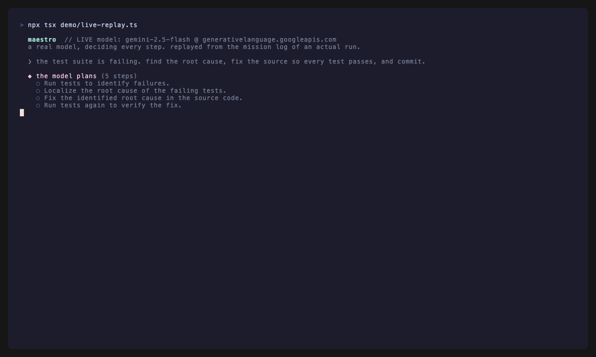
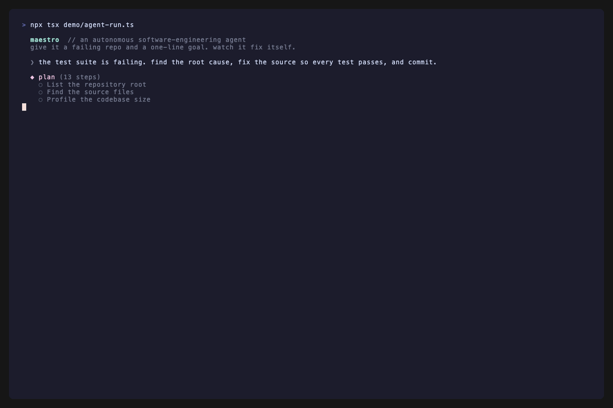

# maestro

An autonomous software-engineering agent. Point it at a repository with a goal, like "make
the failing tests pass" or "add feature X", and it plans, edits, runs the tests, and iterates
until the goal is verifiably met. The model decides what to do. The runtime gives it a coherent
toolset, isolated subagents, durable working memory, and production guardrails.

### A real model actually solving it



> Not the mock — a **live model** (Gemini 2.5 Flash, through the provider-agnostic adapter) driving
> every decision: it plans, runs the tests, reads the source, diagnoses that `add` subtracts instead
> of adds, patches it, re-runs to green, and commits. 19 tool calls, no human in the loop,
> acceptance-gate verified. The clip is replayed from the run's own mission log
> (`demo/live-solve/mission.jsonl`) — the events are exactly what the model did. Reproduce with a
> free Gemini or Groq key: `OPENAI_API_KEY=… MAESTRO_OPENAI_BASE_URL=… npx tsx demo/live-run.ts`.

### The full machinery (deterministic, CI-verified)



> The same agent on a harder repo, driven by the mock provider so CI can run it with no API key: it
> plans 13 steps, runs the tests, composes `run_tests` into `localize_failure`, delegates an audit to
> an isolated subagent, survives a context compaction mid-run, patches both bugs, re-verifies green,
> and commits. 27 tool calls, plan coherent throughout
> ([`demo/agent-run.ts`](demo/agent-run.ts)). There's also a
> [code tour](demo/maestro-demo.gif) of the registry, subagent, and compaction internals.

```
maestro run "the test suite is failing; find the root cause, fix it, and commit" --repo ./some-project
maestro eval            # deterministic eval suite (no API key needed)
maestro tools           # list the 61-tool registry
```

## Why it's shaped this way

The agent is one loop (`src/agent/loop.ts`) that the model steers through tool use. Everything
else is structure that keeps a long autonomous run correct.

| Concern | Where | What it does |
| --- | --- | --- |
| **Tool registry** | `src/tools/registry.ts` | 61 tools across 8 namespaces are self-describing `Tool<I,O>` values in a `Map`. Anthropic JSON schemas are generated from zod. Dispatch is one validated code path, so there is no `switch (toolName)` to grow. |
| **Tool retrieval** | `src/tools/retrieval.ts` | At 61 tools, advertising every schema each call is costly and hits provider token limits. A lexical BM25 selector advertises a relevant subset per turn (control plane + coding essentials + top-ranked + recently-used), cutting schema tokens ~47%; `agent.find_tools` surfaces the long tail. Grounded in RAG-MCP / ToolLLM (see `docs/research/`). |
| **Subagent orchestration** | `src/subagent/spawn.ts` | `agent.spawn` runs the same loop with an isolated context, a registry subset scoped to the granted tools, its own budget and trace span, and a schema-validated return. The parent sees only that return, never the child's transcript. |
| **Long-horizon execution** | `src/agent/ledger.ts`, `src/agent/context.ts` | A durable plan ledger holds the plan, established facts, and file digests. It is re-rendered into the system prompt on every call, so it outlives the compaction that summarizes stale tool output away. Plan coherence lives in code, not in a prompt instruction. |
| **Acceptance gate** | `src/agent/gate.ts` | Completion is a fact the runtime checks, not a claim the model makes. Before a run finishes, the loop runs the checks itself (tests pass, build passes, the tree is committed, the plan is closed) and refuses "done" until green, feeding failures back. |
| **Crash-resume** | `src/agent/mission-log.ts` | An append-only mission log checkpoints the ledger snapshot + message window every step. `maestro resume <id>` rebuilds a killed run in a fresh process from the last checkpoint and finishes it. |
| **Composable I/O** | `src/tools/schemas.ts` | `shell.run_tests` emits a `TestRunResult`. `code.localize_failure` declares that same schema as its input and ranks candidate files. `fs.read_many` then reads them. The chain type-checks. |
| **Production scaffolding** | `src/obs/`, `src/resilience/` | pino structured logs, a JSONL span tracer, exponential backoff with jitter, a token-bucket rate limiter on every external call, a typed error hierarchy, an eval harness, and a unit + integration test suite. |

## The canonical chain

```
shell.run_tests -> code.localize_failure(testRun) -> fs.read_many(candidates) -> fs.edit -> shell.run_tests
```

`code.localize_failure` takes the structured output of `shell.run_tests` as input. The shared
`TestRunResultSchema` in `src/tools/schemas.ts` is what makes that connection a compile-time
type, not a convention. The tool scores source files against the parsed failures and returns
ranked candidates for the editor to target. The eval verifies the actual data flowed through,
not just the call order.

## Namespaces (61 tools)

`fs.*` (14), `git.*` (15), `code.*` (9), `shell.*` (6), `plan.*` (5), `agent.*` (3),
`github.*` (7), `web.*` (2). Run `maestro tools` for the full annotated list.

## Architecture at a glance

```
CLI (commander) -> runTask (composition root)
                     |- AnthropicProvider | MockProvider     (src/llm)
                     |- ToolRegistry  (60 tools, 8 namespaces)
                     |- ConversationContext + Ledger          (context mgmt + durable memory)
                     |- RateLimiterRegistry / retry / errors   (resilience)
                     |- Tracer + pino logger                   (observability)
                     +- runAgent (the one loop) --spawns--> runAgent (subagent, scoped + isolated)
```

## Running

```bash
npm install
cp .env.example .env        # set ANTHROPIC_API_KEY (or ANTHROPIC_AUTH_TOKEN) for live runs

npm run test                # 59 unit + integration tests
npm run eval                # 5 deterministic eval scenarios across 3 fixtures (no API key)
npm run eval -- --real      # same tasks against the live model
npm run build && node dist/index.js run "fix the failing tests" --repo ./path
node dist/index.js resume <missionId> --repo ./path                            # resume a crashed run
node dist/index.js run "audit this repo" --repo ./path --permission readonly   # observe-only run
```

What the eval proves, and what it does not. The suite drives the **real** loop, registry,
subagent, acceptance gate, and mission log through a **deterministic mock provider**, so CI
verifies the runtime **invariants** on every push with no network: a 20+ call session with required
subagent delegation and the run_tests→localize composition; the same task under a tiny context
budget that forces compaction and asserts the plan survives; a cross-file bug and a multi-bug repo;
and a crash-and-resume scenario that aborts mid-task, then resumes from the mission log in a fresh
context and finishes green. It is strong proof of the machinery. It is **not** proof of live-model
autonomy. That is what `--real` is for (see [Authentication](#authentication); the live path is
wire-verified but a full run needs a non-throttled key). See [`docs/XARC.md`](docs/XARC.md) for the
honest map of what's deep, what's deliberately small, and how it was built.

## Authentication

Live runs use one of two credentials, read from the environment:

- `ANTHROPIC_API_KEY` for a standard pay-per-token API key.
- `ANTHROPIC_AUTH_TOKEN` for a Claude Code OAuth (subscription) token. In this mode the provider
  sends a Bearer token with the oauth beta header and prepends the Claude Code identity that the
  API requires. Subscription tokens are rate-limited for burst use, so a long autonomous run may
  throttle; a pay-per-token key runs without that limit.

## Observability

Every run writes a JSONL trace under `.maestro/traces/`. The spans nest by parent id, so a
trace reconstructs the full causal tree of model calls, tool calls, and subagent runs. Logs are
structured through pino. Set `MAESTRO_LOG_PRETTY=1` for human-readable output.

See [`MEMO.md`](./MEMO.md) for what was built, what was cut, and the design decision I would
defend.
